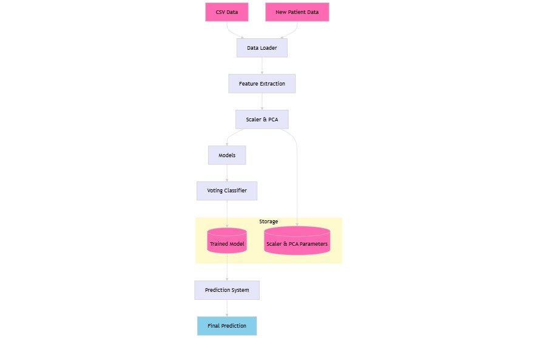
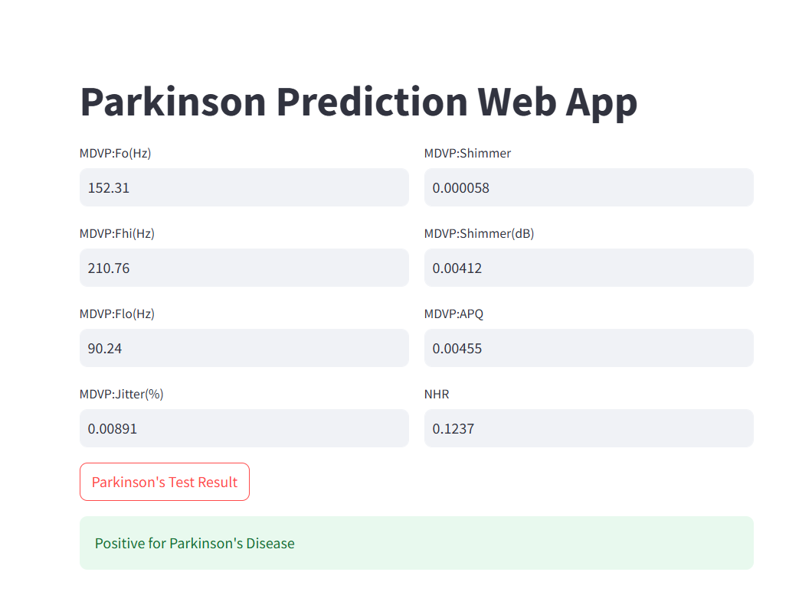
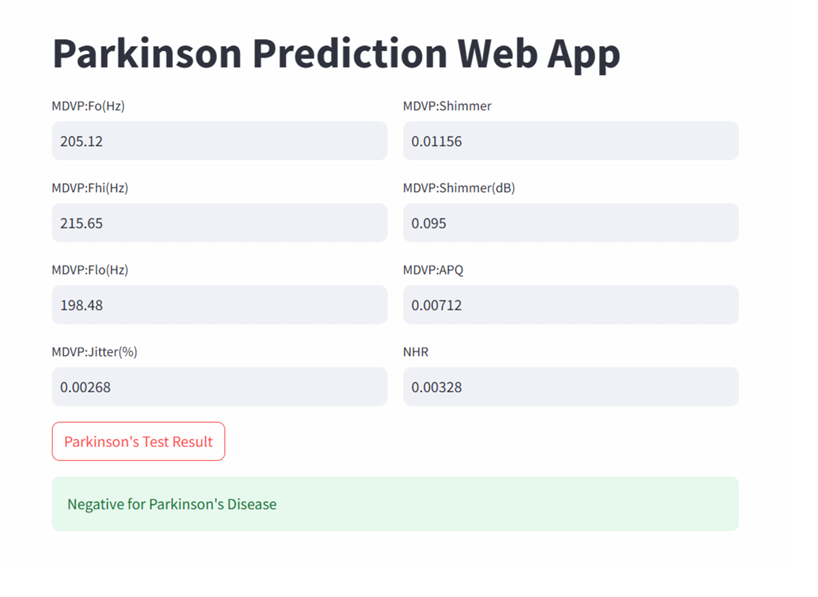

## Title of the Project
A Parkinson’s disease prediction system using a hybrid SVM-Random Forest model with SMOTE and PCA for enhanced early detection accuracy.

## About
A Parkinson’s disease prediction system utilizing a hybrid machine learning model, combining Support Vector Machine (SVM) and Random Forest classifiers, aimed at enhancing diagnostic accuracy. This system leverages data preprocessing techniques, such as Synthetic Minority Over-sampling Technique (SMOTE) and Principal Component Analysis (PCA), to improve model performance and identify key patterns in patient data, providing a reliable tool for early detection and support in clinical decision-making.

## Features

- Hybrid model combining SVM and Random Forest for accurate predictions.
- Advanced data preprocessing using SMOTE and PCA to improve model performance.
- High test accuracy aimed for reliable early detection of Parkinson's disease.
- Scalable and adaptable for various clinical settings.
- User-friendly interface for efficient patient data input and result visualization.

## Requirements
<!--List the requirements of the project as shown below-->
* Operating System: Requires a 64-bit OS (Windows 10 or Ubuntu) for compatibility with deep learning frameworks.
* Development Environment: Python 3.8 or later for implementing the Parkinson’s disease prediction system.
* Machine Learning Libraries: Scikit-learn for model building, SMOTE for data balancing, PCA for dimensionality reduction.
* Data Processing Libraries: Pandas and NumPy for handling and preprocessing data.
* Version Control: Implementation of Git for collaborative development and effective code management.
* IDE: Use of VSCode or Jupyter notebook as the Integrated Development Environment for coding, debugging, and version control integration.
* Additional Dependencies: Matplotlib and Seaborn for data visualization, joblib for model persistence, and Streamlit for application deployment.

## System Architecture

## Output

<!--Embed the Output picture at respective places as shown below as shown below-->
#### Output1 - Person is Positive for Parkinson Disease

#### Output2 - Person is Negative for Parkinson Disease

Detection Accuracy: 92%

Note: These metrics are customizable and should be tailored to reflect actual performance evaluations and project requirements for best results.

## Results and Impact
<!--Give the results and impact as shown below-->
The Parkinson’s Disease Prediction System offers an effective tool for early diagnosis, aiding healthcare professionals in making timely clinical decisions. With its high accuracy and advanced data processing techniques, this project has the potential to improve patient outcomes and support proactive treatment strategies.

This system contributes to advancements in healthcare technology and serves as a foundation for future predictive models, promoting early intervention and enhancing quality of life for individuals at risk of Parkinson’s disease.

## Articles published / References
1.  Vaishnavi, "SVM-based approach for Parkinson's detection using vocal data," International
 Research Journal of Modernization in Engineering Technology and Science, vol. 5, no. 5, 2023.

2. Doneti Sowmya, Dodla Kavya, J. Rashmitha, Satheesh Kumar V., and Preethi Jeevan,
 "Parkinson’s Disease Detection By Machine Learning Using SVM," International Research
 Journal of Engineering and Technology (IRJET), vol. 10, no. 01, pp. 1097. e-ISSN: 2395-0056,
 p-ISSN: 2395-0072, 2023.

3. J. Mei, C. Desrosiers, and J. Frasnelli, "Machine Learning for the Diagnosis of Parkinson’s
 Disease: A Review of Literature," Frontiers in Aging Neuroscience, vol. 13, no. 633752, pp. 1–13,
 2021

 4.  S. Haller, S. Badoud, D. Nguyen, V. Garibotto, K.O. Lovblad, P.R. Burkhard, "Individual
 Detection of Patients with Parkinson Disease using Support Vector Machine Analysis of
 Diffusion Tensor Imaging Data: Initial Results," AJNR Am J Neuroradiol, vol. 33, no. 11, pp.
 2123-2128, 2012

 5. W. A. Mir, D. R. Rizvi, I. Nissar, S. Masood, Izharuddin, and A. Hussain, "Deep Learning based
 model for the detection of Parkinson's disease using voice data," in 2022 First International
 Conference on Artificial Intelligence Trends and Pattern Recognition (ICAITPR), 2022, DOI:
 10.1109/ICAITPR51569.2022.9844185

 6.  C. K. Gomathy, B. Dheeraj Kumar Reddy, B. Varsha, and B. Varshini, "The Parkinson's Disease
 Detection Using Machine Learning Techniques," International Research Journal of Engineering and
 Technology (IRJET), vol. 08, no. 10, pp. 440-444, 2021.

 7.  V. Balu, M. Varsha Reddy, and Y. V. Leelaprasad Reddy, "Detecting Parkinson's Disease,"
 International Research Journal of Modernization in Engineering Technology and Science, vol. 04, no.
 03, pp. 1420-1424, 2022

 8. Govindu, Aditi et al., "Parkinson's Disease Classification using Vowel Phonation and Machine
 Learning," Procedia Computer Science, vol. 218, pp. 249-261, 2023

 9.  Hayder Mohammed Qasim, Oguz Ata, Mohammad Azam Ansari, Mohammad N. Alomary, Saad
 Alghamdi, and Mazen Almehmadi, "Hybrid Feature Selection Framework for the Parkinson
 Imbalanced Dataset Prediction Problem," Medicina, vol. 57, no. 11, p. 1217, 2021

 10.  K. Polat, "A Hybrid Approach to Parkinson Disease Classification using speech signal: The
 Combination of SMOTE and Random Forests," 2019 IEEE International Symposium on INnovations
 in Intelligent Systems and Applications (INISTA), pp. 1-5, 2019

 11. M. Pramanik, R. Pradhan, P. Nandy, A.K. Bhoi, and P. Barsocchi, "Machine Learning Methods
 with Decision Forests for Parkinson's Detection," Applied Sciences, vol. 11, no. 2, pp. 581, 2021

 12.  L. Ali, A. Javeed, A. Noor, H. T. Rauf, S. Kadry, and A. H. Gandomi, "Parkinson’s disease
 detection based on features refinement through L1 regularized SVM and deep neural network,"
 Scientific Reports, vol. 14, no. 1333, pp. 1-12, 2024

